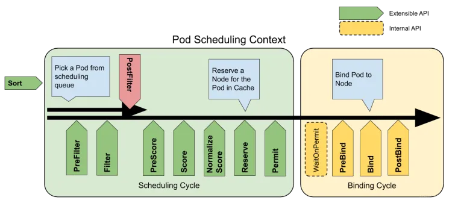

# vgpu-manager-scheduler-plugin

The scheduling plugin for [vgpu-manager](https://github.com/coldzerofear/vgpu-manager), implemented using the k8s scheduling framework.



This plugin implements some extension points in the `Scheduling Cycle` and `Binding Cycle`, without using webhook functions, performance has been improved.

## Deploy

This scheduler plugin cannot be used simultaneously with the scheduler in vgpu manager (as it may cause conflicts). Choose one to deploy according to your needs.

```yaml
kubectl apply -f ./deploy/deployment.yaml
```

## Build Image

```bash
make docker-build IMG=<your-image-tag>
```